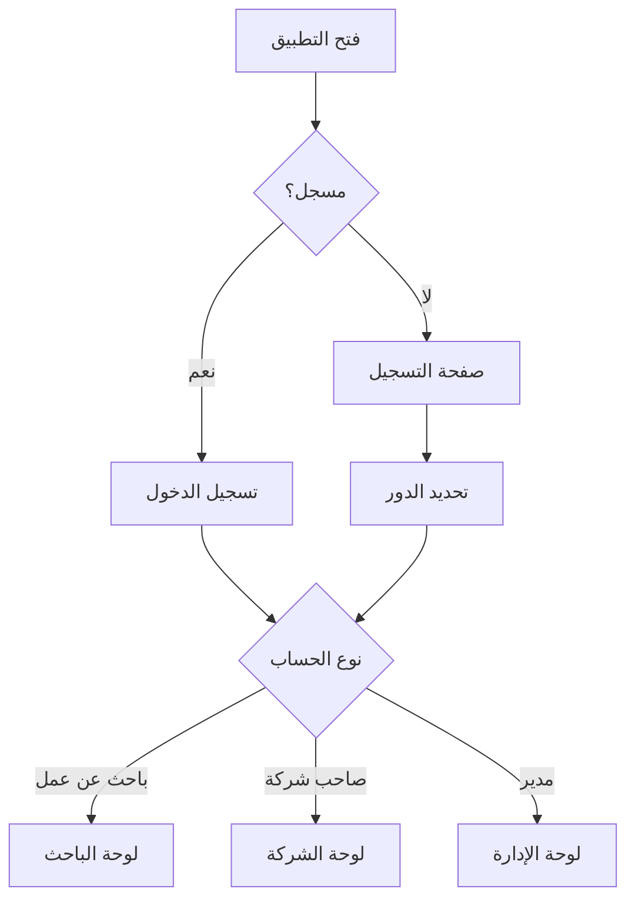

# تدفق المستخدم - Job Search Platform

---

## 🔄 التدفق العام



---

## 👤 تدفق الباحث عن عمل (JobSeeker)

### 1. التسجيل والتحقق

```
POST /api/auth/register
{ full_name, email, password, phone }
                ↓
POST /api/auth/send-verification
{ email }
                ↓
POST /api/auth/verify-account
{ email, token }
                ↓
POST /api/auth/set-role
{ role: "JobSeeker" }
                ↓
Profile Created ✓
```

### 2. تسجيل الدخول

```
POST /api/auth/login → Token
GET /api/auth/me → User + Role + Profile
```

### 3. إدارة الملف الشخصي

```
GET /api/profile → عرض البيانات
POST /api/profile → إنشاء
PUT /api/profile → تحديث (photo, location, summary)
DELETE /api/profile → حذف
```

### 4. إدارة السيرة الذاتية

```
GET /api/cvs → قائمة CVs
POST /api/cvs → إنشاء CV جديد
GET /api/cvs/{id} → تفاصيل CV
PUT /api/cvs/{id} → تحديث
DELETE /api/cvs/{id} → حذف

إضافة محتوى:
├── POST /api/cvs/{id}/skills → مهارة
├── POST /api/cvs/{id}/education → تعليم
├── POST /api/cvs/{id}/experience → خبرة
└── POST /api/cvs/{id}/languages → لغة
```

### 5. البحث عن وظائف

```
GET /api/jobs → جميع الوظائف
GET /api/jobs?keyword=developer → بحث بكلمة
GET /api/jobs?location=Sana'a → بحث بالموقع
GET /api/jobs?work_type=full_time → بحث بنوع العمل
GET /api/jobs?salary_min=500&salary_max=2000 → بحث بالراتب
GET /api/jobs?skill_ids=1,2,3 → بحث بالمهارات
GET /api/jobs/{id} → تفاصيل الوظيفة
```

### 6. حفظ وظيفة مفضلة

```
POST /api/favorites/{jobId} → حفظ
GET /api/favorites → قائمة المفضلة
DELETE /api/favorites/{jobId} → إزالة
```

### 7. التقديم على وظيفة

```
POST /api/applications
{ job_id, cv_id, notes }
                ↓
GET /api/applications → قائمة طلباتي
GET /api/applications/{id} → تفاصيل الطلب
POST /api/applications/{id}/withdraw → سحب الطلب
```

### 8. متابعة الشركات

```
GET /api/companies → قائمة الشركات
GET /api/companies/{id} → تفاصيل الشركة
POST /api/companies/{id}/follow → متابعة
DELETE /api/companies/{id}/follow → إلغاء المتابعة
```

### 9. الدورات التدريبية

```
GET /api/courses → قائمة الدورات
GET /api/courses/{id} → تفاصيل الدورة
GET /api/courses/my-enrollments → تسجيلاتي
POST /api/courses/{id}/enroll → التسجيل
DELETE /api/courses/{id}/enroll → إلغاء التسجيل
```

---

## 🏢 تدفق صاحب الشركة (Employer)

### 1. التسجيل

```
POST /api/auth/register
{ full_name, email, password, phone }
                ↓
POST /api/auth/set-role
{ role: "Employer" }
                ↓
Company Profile Created ✓
```

### 2. إدارة ملف الشركة

```
GET /api/profile → بيانات الشركة
POST /api/profile → إنشاء
PUT /api/profile → تحديث
{ company_name, description, logo_path, website_url, ... }
DELETE /api/profile → حذف
```

### 3. إدارة الوظائف

```
GET /api/employer/jobs → وظائفي
POST /api/employer/jobs → إنشاء وظيفة (Draft)
PUT /api/employer/jobs/{id} → تعديل
POST /api/employer/jobs/{id}/publish → نشر (Active)
DELETE /api/employer/jobs/{id} → حذف/إغلاق
```

### 4. إدارة الطلبات

```
GET /api/employer/jobs/{jobId}/applications → قائمة المتقدمين
PUT /api/employer/applications/{id}/status
{ status: "Reviewed" | "Shortlisted" | "Interviewing" | "Offered" | "Hired" | "Rejected" }
```

### 5. إدارة الدورات التدريبية

```
GET /api/employer/courses → دوراتي
POST /api/employer/courses → إنشاء دورة
{ title, topics, duration, location, trainer, fees, start_date }
PUT /api/employer/courses/{id} → تحديث
POST /api/employer/courses/{id}/publish → نشر
POST /api/employer/courses/{id}/close → إغلاق
DELETE /api/employer/courses/{id} → حذف
```

### 6. إدارة المسجلين في الدورات

```
GET /api/employer/courses/{id}/enrollments → قائمة المسجلين
POST /api/employer/courses/{id}/notify → إرسال إشعار
{ title, message, type: "reminder" | "update" | "cancellation" | "info" }
```

---

## 🛡️ تدفق مدير النظام (Admin)

### 1. إدارة المستخدمين

```
GET /api/admin/users → قائمة المستخدمين
GET /api/admin/users?search=ahmed → بحث
GET /api/admin/users?role=JobSeeker → تصفية بالدور
GET /api/admin/users?status=blocked → تصفية بالحالة
GET /api/admin/users/{id} → تفاصيل مستخدم
POST /api/admin/users → إنشاء مستخدم
{ full_name, email, password, role, phone }
PUT /api/admin/users/{id} → تحديث
```

### 2. حظر/إلغاء حظر

```
POST /api/admin/users/{id}/block
{ reason: "سبب الحظر" }
                ↓
POST /api/admin/users/{id}/unblock
```

### 3. الإحصائيات

```
GET /api/admin/users/statistics
→ {
    total_users,
    job_seekers,
    employers,
    verified_users,
    blocked_users,
    new_users_today,
    new_users_this_week
}
```

---

## 🔔 مشترك بين الجميع

### الإشعارات

```
GET /api/notifications
PUT /api/notifications/{id}/read
POST /api/notifications/mark-all-read
```

### المحادثات

```
GET /api/conversations
GET /api/conversations/{id}/messages
POST /api/conversations/{id}/messages
{ content: "..." }
```

### البيانات المرجعية

```
GET /api/skills → قائمة المهارات
GET /api/skill-categories → تصنيفات المهارات
GET /api/languages → قائمة اللغات
```

---

## 🔐 إدارة الحساب

### تغيير كلمة المرور

```
POST /api/auth/change-password
{ current_password, new_password }
```

### نسيت كلمة المرور

```
POST /api/auth/forgot-password
{ email }
                ↓
POST /api/auth/reset-password
{ email, token, password, password_confirmation }
```

### تسجيل الخروج

```
POST /api/auth/logout
```

---

## 📊 ملخص الـ APIs

| القسم             | عدد الـ Endpoints |
| ----------------- | ----------------- |
| المصادقة          | 12                |
| الملف الشخصي      | 4                 |
| السيرة الذاتية    | 11                |
| الوظائف           | 12                |
| الطلبات           | 6                 |
| الشركات           | 4                 |
| الدورات           | 13                |
| الإشعارات         | 3                 |
| المحادثات         | 3                 |
| الإدارة           | 7                 |
| البيانات المرجعية | 3                 |
| **الإجمالي**      | **78**            |
